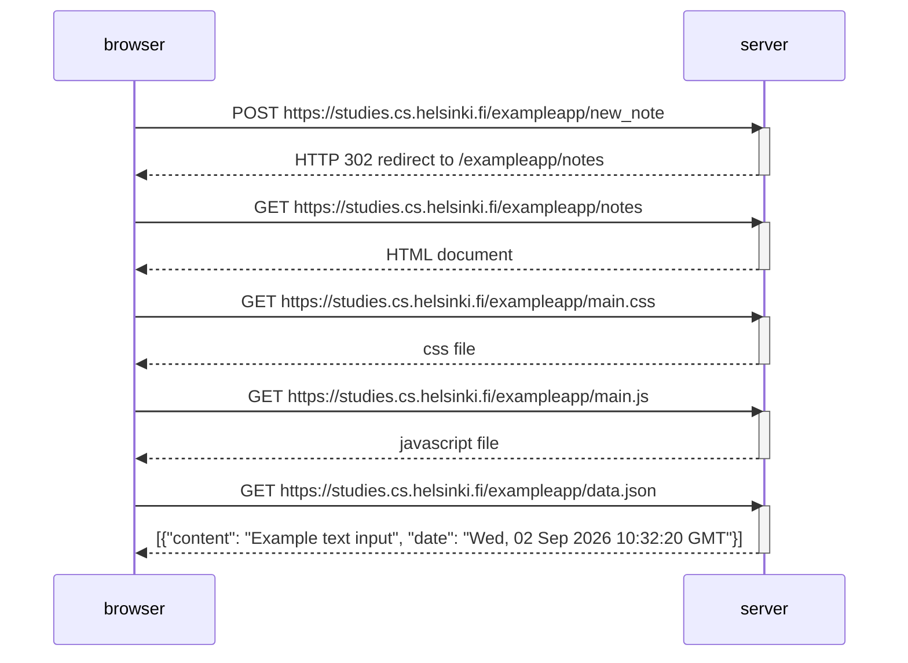
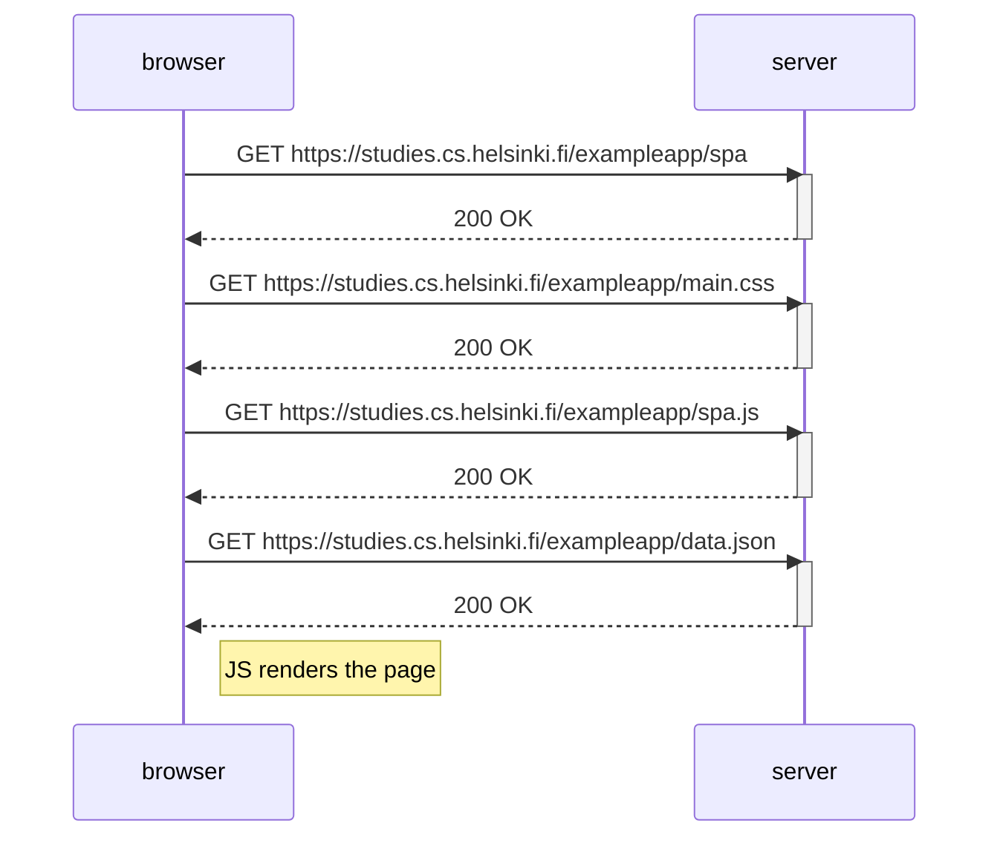
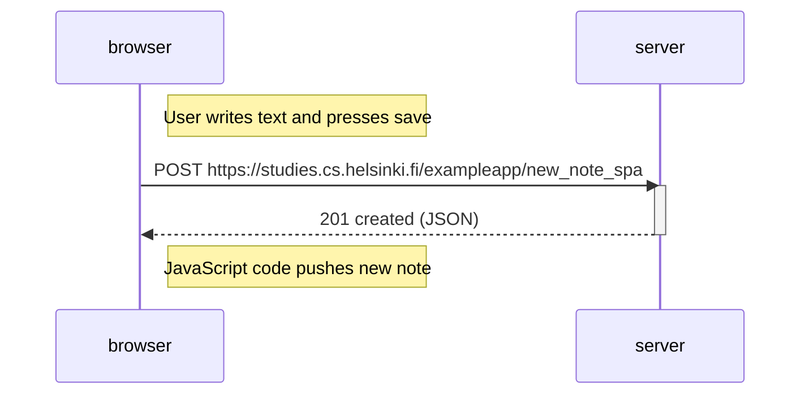

```mermaid
    sequenceDiagram
        participant browser
        participant server
        browser ->> server: POST https://studies.cs.helsinki.fi/exampleapp/new_note
        activate server
        server -->> browser: HTTP 302 redirect to /exampleapp/notes
        deactivate server

        browser ->> server: GET https://studies.cs.helsinki.fi/exampleapp/notes
        activate server
        server -->> browser: HTML document
        deactivate server

        browser ->> server: GET https://studies.cs.helsinki.fi/exampleapp/main.css
        activate server
        server -->> browser: css file
        deactivate server

        browser ->> server: GET https://studies.cs.helsinki.fi/exampleapp/main.js
        activate server
        server -->> browser: javascript file
        deactivate server
        browser ->> server: GET https://studies.cs.helsinki.fi/exampleapp/data.json
        activate server
        server -->> browser: [{"content": "Example text input", "date": "Wed, 02 Sep 2026 10:32:20 GMT"}]
        deactivate server
```

```mermaid
    sequenceDiagram
        participant browser
        participant server

        browser ->> server: GET https://studies.cs.helsinki.fi/exampleapp/spa
        activate server
        server -->> browser: 200 OK
        deactivate server
        browser ->> server: GET https://studies.cs.helsinki.fi/exampleapp/main.css
        activate server
        server -->> browser: 200 OK
        deactivate server
        browser ->> server: GET https://studies.cs.helsinki.fi/exampleapp/spa.js
        activate server
        server -->> browser: 200 OK
        deactivate server
        browser ->> server: GET https://studies.cs.helsinki.fi/exampleapp/data.json
        activate server
        server -->> browser: 200 OK
        deactivate server
        Note right of browser: JS renders the page
```

```mermaid
    sequenceDiagram
        participant browser
        participant server 
        Note right of browser: User writes text and presses save;
        browser ->> server: POST https://studies.cs.helsinki.fi/exampleapp/new_note_spa
        activate server
        server -->> browser: 201 created (JSON)
        deactivate server
        Note right of browser: JavaScript code pushes new note
```